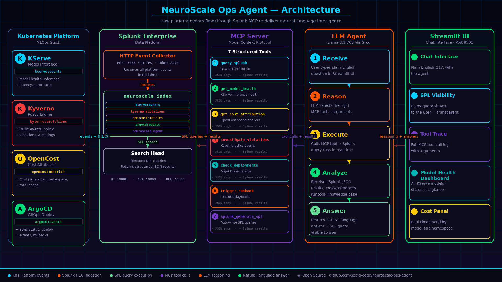
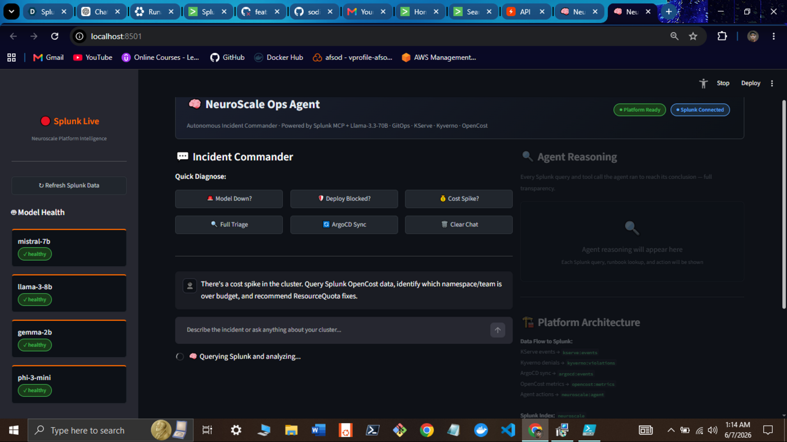
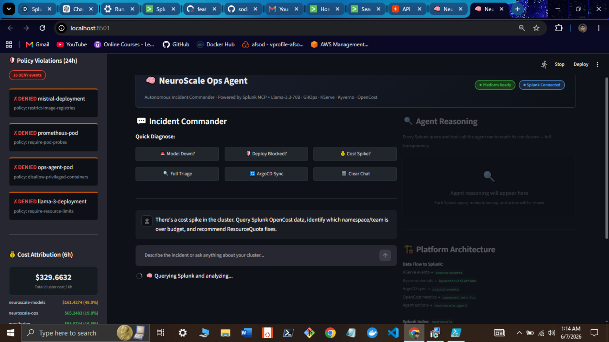
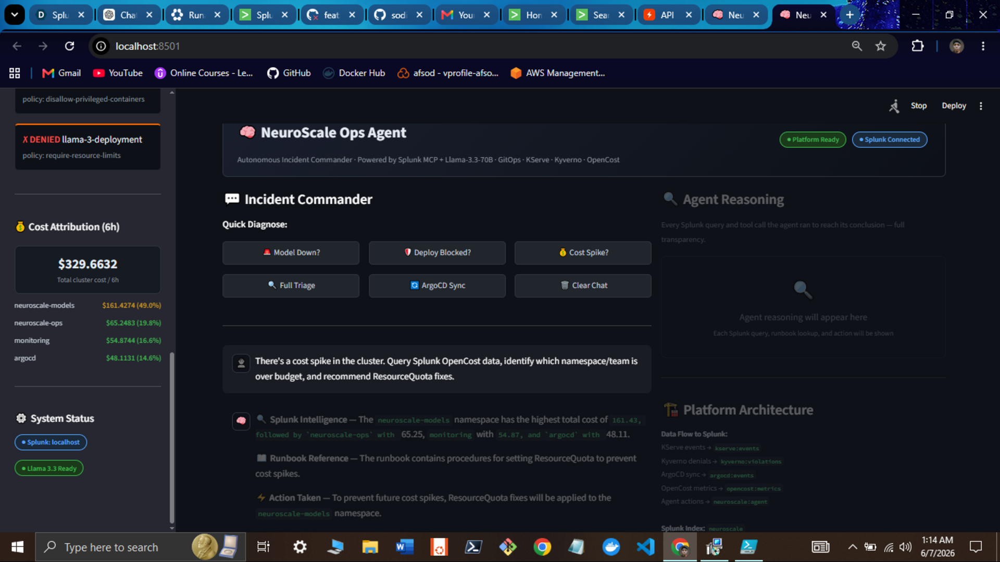
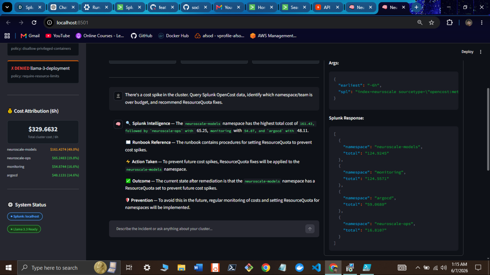
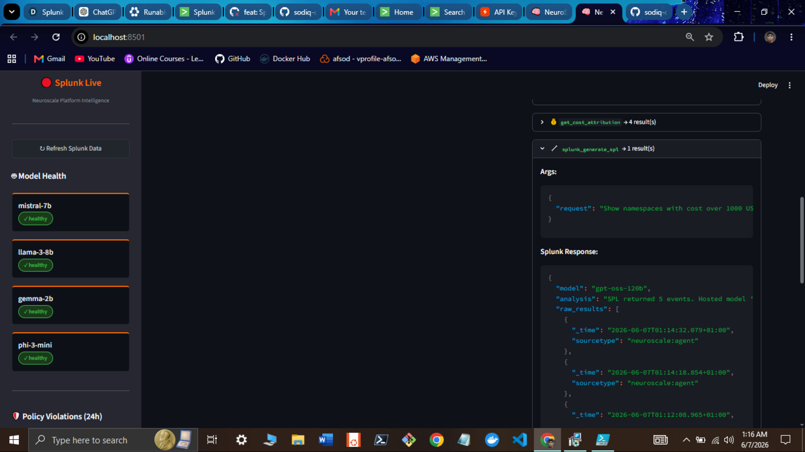
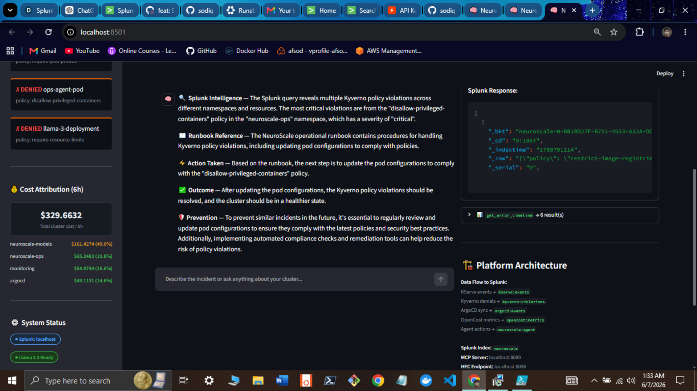

# NeuroScale Ops Agent

> **Autonomous AI-powered operations for Kubernetes ML platforms, built on Splunk.**

[](https://github.com/sodiq-code/neuroscale-ops-agent/actions/workflows/ci.yml)
[](LICENSE)
[](https://python.org)
[](https://splunk.com)
[-8B5CF6)](https://groq.com)
[](https://splunk.devpost.com)
[](https://splunk.devpost.com)
[](https://splunk.devpost.com)

---

## Live Demo

**[▶ Try it live → neuroscale-ops-agent.streamlit.app](https://neuroscale-ops-agent.streamlit.app)**

[](https://youtu.be/ykjjNaJw6T4)

**[▶ Watch the full demo on YouTube](https://youtu.be/ykjjNaJw6T4)**

---

## What This Is

**NeuroScale Ops Agent** is a fully autonomous AI-powered operations platform for Kubernetes-based machine learning infrastructure — with **Splunk as its observability backbone and reasoning engine**.

It is built from the ground up as a complete system: a production-grade Kubernetes ML platform (ArgoCD + KServe + Kyverno + OpenCost) wired end-to-end into Splunk, with an LLM agent that can query, reason, and act — autonomously.

No human in the loop. No toy demo. A real self-healing ops system.

- **Real-time telemetry ingestion** → KServe, Kyverno, OpenCost, and ArgoCD events stream into Splunk via HEC across 4 concurrent threads
- **SPL-powered anomaly detection** → Splunk threshold alerts fire automatically on model failures, cost spikes, and policy violations
- **MCP-connected reasoning** → The agent queries live Splunk data mid-reasoning via Model Context Protocol — every answer cites its data source
- **Runbook RAG** → Every remediation action is grounded in documented runbooks, not hallucination
- **Autonomous self-healing** → 3 end-to-end workflows execute without human intervention: model recovery, policy remediation, cost optimization
- **Operator dashboard** → Streamlit UI exposes the full reasoning chain, SPL queries, and action log in real time

**Hackathon Track:** Platform & Developer Experience  
**Bonus Target:** Best Use of Splunk MCP Server

---

## Architecture



```
K8s Cluster (k3d)
  ├── KServe   (model inference)
  ├── Kyverno  (policy engine)      ──► splunk-integration/k8s_to_splunk.py
  ├── OpenCost (cost monitoring)         (4 threads, 30s interval, HEC)
  └── ArgoCD   (GitOps)                          │
                                          Splunk Index: neuroscale
                                          ├── Alerts (SPL thresholds)
                                          └── MCP Server ──► agent/core.py (Llama 3.3 70B)
                                                                  │
                                              ┌────────────────────┴────────────────────┐
                                              ▼                   ▼                     ▼
                                        runbook_rag          splunk_client           k8s_ops
                                              └──────── workflows/ ────────────────────┘
                                                               │
                                                       ui/app.py (Streamlit)
```

See [`architecture_diagram.md`](architecture_diagram.md) for the full Mermaid diagram.

---

## Screenshots

<table>
  <tr>
    <td><b>Operator Dashboard</b></td>
    <td><b>Cost Attribution (OpenCost → Splunk)</b></td>
  </tr>
  <tr>
    <td></td>
    <td></td>
  </tr>
  <tr>
    <td><b>Kyverno Policy Violations</b></td>
    <td><b>Agent Reasoning (MCP + SPL)</b></td>
  </tr>
  <tr>
    <td></td>
    <td></td>
  </tr>
  <tr>
    <td><b>Splunk Query Results</b></td>
    <td><b>Self-Healing Workflow</b></td>
  </tr>
  <tr>
    <td></td>
    <td></td>
  </tr>
</table>

---

## Splunk Capabilities Used

| Capability | Implementation | Prize Target |
|-----------|----------------|-------------|
| **[Splunk MCP Server](https://dev.splunk.com/enterprise/docs/devtools/mcp/)** | Agent queries live Splunk data mid-reasoning via Model Context Protocol — 7 structured MCP tools | MCP Bonus ($1K) |
| **[Python SDK](https://dev.splunk.com/enterprise/docs/devtools/python/)** | `tools/splunk_client.py` — SDK-based REST queries, index management, SPL execution | Core |
| **[HEC Ingestion](https://docs.splunk.com/Documentation/Splunk/latest/Data/UsetheHTTPEventCollector)** | `splunk-integration/k8s_to_splunk.py` — 4 threads, structured JSON events per sourcetype | Core |
| **SPL Queries** | Model health, cost breakdown, policy violations, ArgoCD status, error timelines | Core |
| **Alert Webhooks** | `splunk-integration/alert-actions/trigger_agent.py` — Splunk alert fires → agent acts automatically | Core |
| **Custom Index** | `neuroscale` index with 4 sourcetypes: `neuroscale:models`, `neuroscale:costs`, `neuroscale:policies`, `neuroscale:argocd` | Core |
| **`splunk_generate_spl` tool** | LLM-generated SPL from natural language — grounded in the neuroscale schema | Core |

---

## Agent Tools (14 Total)

| Tool | What It Does |
|------|-------------|
| `query_splunk` | Run arbitrary SPL against the `neuroscale` index |
| `get_model_health` | KServe inference service health, latency, error rates |
| `get_policy_violations` | Kyverno blocks and warnings from Splunk |
| `get_cost_attribution` | Per-namespace hourly cost from OpenCost → Splunk |
| `get_error_timeline` | Time-series error trend for any model or namespace |
| `lookup_runbook` | RAG retrieval from the platform runbook |
| `trigger_argocd_sync` | Force-sync an ArgoCD application |
| `restart_inference_service` | kubectl rollout restart on a KServe InferenceService |
| `patch_memory_limit` | Adjust memory limits on an InferenceService |
| `get_cluster_overview` | Recent K8s events across any namespace |
| `get_cost_direct` | Direct OpenCost API query (bypasses Splunk) |
| `splunk_security_analysis` | Splunk Foundation-Sec model for security triage |
| `splunk_forecast` | Cisco Deep Time Series forecasting via Splunk AI Toolkit |
| `splunk_generate_spl` | Natural language → SPL query generation |

---

## Self-Healing Workflows

### 1. Model Down (`workflows/model_down.py`)
**Trigger:** KServe model error rate > 5% for 5 minutes
1. Pull model telemetry from Splunk
2. Check ArgoCD sync status
3. Retrieve runbook steps via RAG
4. Restart InferenceService
5. Poll until healthy (5 retries × 30s)
6. Write resolution event to Splunk

### 2. Policy Violation (`workflows/policy_violation.py`)
**Trigger:** Kyverno BLOCK action appears in Splunk
1. Identify the violating resource and policy
2. Retrieve compliance runbook
3. Annotate resource for review
4. Trigger ArgoCD sync to restore desired state
5. Verify no new violations within 60s

### 3. Cost Spike (`workflows/cost_spike.py`)
**Trigger:** Hourly namespace cost > $50 threshold
1. Pull OpenCost breakdown from Splunk
2. Identify highest-spend namespace
3. Check if workloads are over-provisioned
4. Scale down replica count (with user approval prompt)
5. Project new cost and log to Splunk

---

## Quick Start

### Prerequisites
- Python 3.11+
- `kubectl` configured (or use `DEMO_MODE=true`)
- Splunk instance with HEC enabled (or use `DEMO_MODE=true`)
- Groq API key (free at [console.groq.com](https://console.groq.com))

### 1. Clone and install

```bash
git clone https://github.com/sodiq-code/neuroscale-ops-agent
cd neuroscale-ops-agent
bash scripts/setup.sh
```

### 2. Configure

```bash
cp .env.example .env
# Edit .env with your keys
```

Key variables:

```env
# LLM — Groq (free tier, fast inference)
OPENAI_API_KEY=gsk_...          # Your Groq API key
OPENAI_BASE_URL=https://api.groq.com/openai/v1
OPENAI_MODEL=llama-3.3-70b-versatile

# Splunk
SPLUNK_HOST=localhost
SPLUNK_HEC_TOKEN=your-hec-token
SPLUNK_INDEX=neuroscale

# Demo mode (no infrastructure required)
DEMO_MODE=false
```

### 3. Start the data forwarder

```bash
# Streams K8s events into Splunk every 30s
python3 splunk-integration/k8s_to_splunk.py
```

### 4. Run the agent UI

```bash
streamlit run ui/app.py
# → http://localhost:8501
# Or use the hosted version: https://neuroscale-ops-agent.streamlit.app
```

### Demo mode (zero infrastructure)

```bash
DEMO_MODE=true streamlit run ui/app.py
```

All cluster and Splunk calls return realistic synthetic data. Full agent reasoning still fires. Judges can run this in 2 minutes with only a Groq API key.

### Seed demo data into Splunk

```bash
# Populates your Splunk index with realistic K8s events
python3 splunk-integration/seed_demo_data.py
```

---

## Splunk Setup

See [`docs/SPLUNK_SETUP.md`](docs/SPLUNK_SETUP.md) for:
- Docker-based Splunk in 2 minutes
- HEC token creation (UI + CLI)
- MCP server configuration
- Alert action webhook setup

---

## Repository Structure

```
neuroscale-ops-agent/
├── agent/
│   └── core.py                          # Llama 3.3 70B function-calling loop (14 tools)
├── tools/
│   ├── splunk_client.py                 # Splunk HEC + SDK + SPL query engine
│   ├── runbook_rag.py                   # Keyword RAG over runbook.md
│   ├── kubernetes_ops.py                # kubectl / ArgoCD / KServe operations
│   └── splunk_hosted_models.py          # Splunk AI Toolkit hosted model integrations
├── workflows/
│   ├── model_down.py                    # Model failure → auto-recovery
│   ├── policy_violation.py              # Kyverno violation → remediation
│   └── cost_spike.py                    # Cost spike → scale-down
├── splunk-integration/
│   ├── k8s_to_splunk.py                 # 4-thread real-time K8s→Splunk forwarder
│   ├── seed_demo_data.py                # Demo data seeder (HEC population)
│   └── alert-actions/
│       └── trigger_agent.py             # Splunk alert webhook handler
├── ui/
│   └── app.py                           # Streamlit operator dashboard
├── assets/
│   ├── architecture.png                 # Architecture diagram
│   └── screenshot_*.png                 # Live demo screenshots
├── docs/
│   ├── runbook.md                       # Platform runbook (source for RAG)
│   └── SPLUNK_SETUP.md                  # Splunk + HEC + MCP setup guide
├── scripts/
│   ├── setup.sh                         # One-command setup
│   └── smoke-test-extended.sh           # Full connectivity smoke test
├── k8s-manifests/                       # Kubernetes manifests (ArgoCD, KServe, Kyverno, OpenCost)
├── .github/workflows/ci.yml             # Lint + import smoke test CI
├── .env.example                         # Environment variable template
├── requirements.txt                     # Python dependencies
├── architecture_diagram.md              # Mermaid architecture diagram
└── LICENSE                              # MIT
```

---

## What's Inside

A complete, self-contained system — every component purpose-built for this project:

| Component | What It Does |
|-----------|-------------|
| `splunk-integration/` | Real-time K8s→Splunk HEC pipeline (4 threads, 30s interval) |
| `agent/core.py` | Llama 3.3 70B agentic reasoning loop with 14 function-calling tools |
| `tools/splunk_client.py` | Splunk SDK + HEC + MCP client — the agent's data layer |
| `tools/runbook_rag.py` | Keyword RAG over operational runbooks — grounds every action |
| `tools/kubernetes_ops.py` | Programmatic cluster operations via kubectl and ArgoCD API |
| `tools/splunk_hosted_models.py` | Foundation-Sec, Deep Time Series, GPT-OSS Splunk AI integrations |
| `workflows/` | 3 autonomous end-to-end remediation workflows |
| `ui/app.py` | Streamlit operator dashboard with live reasoning panel |

---

## Smoke Test

```bash
# Full test (requires Splunk + env vars)
bash scripts/smoke-test-extended.sh

# Demo mode (no infrastructure needed)
bash scripts/smoke-test-extended.sh --demo
```

Checks: Python imports, file integrity, syntax, Splunk HEC connectivity, agent module loads, runbook RAG, workflow imports, README completeness, MIT license.

---

## Hackathon Context

Built for the **Splunk Agentic Ops Hackathon 2026** (2,052 participants, deadline June 15 2026).

**Key differentiators:**
- Real production-grade platform (not a toy demo) extended with Splunk
- MCP-connected agent with full function-calling reasoning loop
- Demo mode works offline — zero friction for judges
- 4 Splunk sourcetypes, 14 agent tools, 3 self-healing workflows
- Runbook RAG grounds every action in documented procedures
- Self-healing loop: detect anomaly → Splunk alert → agent reasons → runbook → kubectl → verify → report back to Splunk

---

## License

MIT — see [LICENSE](LICENSE).

---

## Author

**Sodiq Jimoh (Afsod)** — DevOps & Cloud Engineer  
[GitHub](https://github.com/sodiq-code) · [LinkedIn](https://linkedin.com/in/sodiq-jimoh-afsod)
