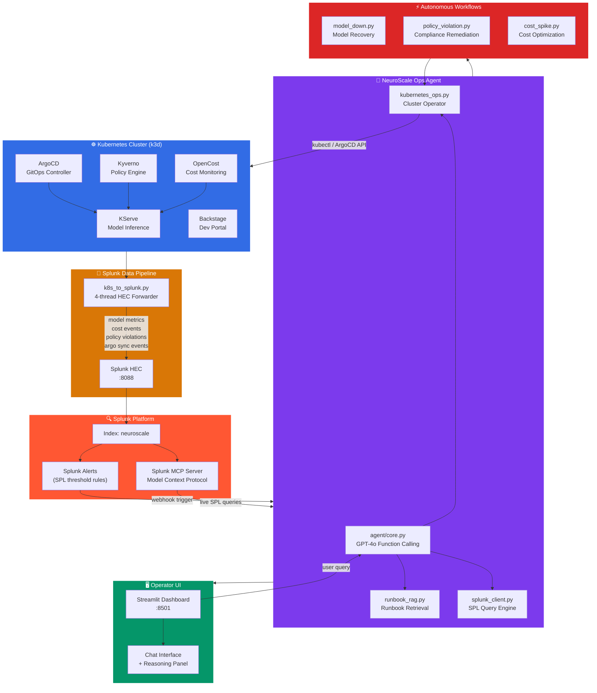

# NeuroScale Ops Agent — Architecture

## System Overview

## Data Flow Narrative

### 1. Ingestion (Real-time)
Every 30 seconds, `k8s_to_splunk.py` runs 4 concurrent threads:
- **Model Thread** → KServe inference service status, latency, error rates
- **Cost Thread** → OpenCost namespace spend, hourly cost deltas
- **Policy Thread** → Kyverno admission webhook violations
- **ArgoCD Thread** → GitOps sync status, out-of-sync applications

All events land in Splunk index `neuroscale` with structured sourcetypes.

### 2. Detection (Splunk Alerts)
SPL-based threshold alerts fire when:
- Model error rate > 5% for 5 minutes → triggers `model_down` workflow
- Hourly cost delta > $50 → triggers `cost_spike` workflow
- Policy violation count > 0 → triggers `policy_violation` workflow

Alert webhook hits `splunk-integration/alert-actions/trigger_agent.py`.

### 3. Reasoning (GPT-4o Agent)
The agent receives the alert context and:
1. Queries runbook RAG for relevant remediation steps
2. Pulls live telemetry from Splunk via SPL
3. Inspects cluster state via kubectl/ArgoCD API
4. Selects the correct workflow to execute
5. Returns structured action plan with confidence score

### 4. Remediation (Autonomous Actions)
Workflows execute in order:
- Gather evidence → Analyze root cause → Execute fix → Verify → Report

### 5. Observability (UI)
Every agent decision is visible in the Streamlit dashboard:
- Reasoning steps panel (chain-of-thought)
- Splunk query results inline
- Action log with timestamps
- Manual override controls

## Component Matrix

| Component | Tech | Purpose |
|-----------|------|---------|
| `agent/core.py` | OpenAI GPT-4o | Orchestration, function-calling |
| `tools/splunk_client.py` | Splunk SDK + HEC | Telemetry ingestion & SPL queries |
| `tools/runbook_rag.py` | Keyword RAG | Runbook retrieval for grounding |
| `tools/kubernetes_ops.py` | `kubectl` subprocess | Cluster inspection & remediation |
| `splunk-integration/` | Python threads | Real-time K8s → Splunk pipeline |
| `workflows/` | Python | Domain-specific remediation logic |
| `ui/app.py` | Streamlit | Operator-facing chat dashboard |
